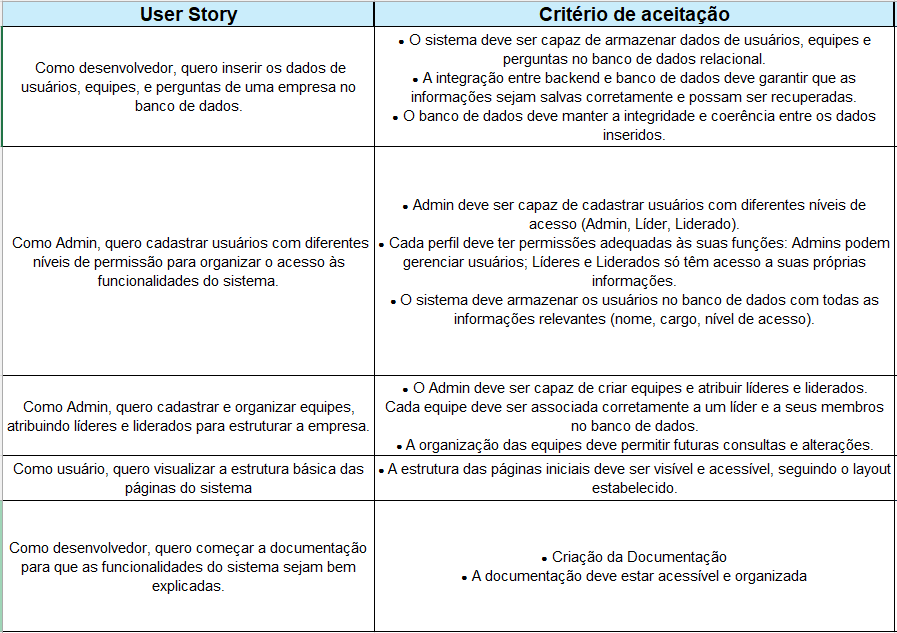

<h1 align="center">Sprint 1️⃣ 🏃 - Concluída 24/09/2023</h1>

    <a href="#objetivos"> - Objetivos da Sprint</a> &nbsp
    <a href="#userstory"> - User Story's</a> &nbsp

 
Durante a primeira sprint, a equipe focou em atividades relacionadas ao desenvolvimento e integração do backend com o banco de dados, além de iniciar o protótipo e a estrutura visual das páginas iniciais do sistema. 

O backend foi desenvolvido para permitir o cadastro de usuários com diferentes níveis de acesso, como Administrador, Líder e Liderado. Além disso, o banco de dados foi configurado para armazenar informações detalhadas dos usuários, incluindo nome, e-mail, senha e suas respectivas permissões. 

Paralelamente, a equipe lidou com a prototipagem e desenvolvimento da estrutura visual das páginas iniciais, criando uma base sólida para o layout e design do sistema. Com isso, a primeira sprint focou na construção das fundações da aplicação, abordando tanto a parte de backend quanto a estrutura visual do frontend, preparando o terreno para as outras funcionalidades que serão desenvolvidas nas próximas sprints.
 

 

## 🎯 Objetivos da Sprint
As tarefas exigidas nessa sprint foram: 
- Conexão entre backend e o banco de dados;
- Registro de usuários com diferentes níveis de acesso;
- Lógica de atribuição de líderes e liderados;
- Estrutura visual das páginas iniciais.

## 👥 User Story's 
A seguir, é possível verificar as User Story's e seus critérios de aceitação detalhados:

→ [Voltar ao topo](#topo)